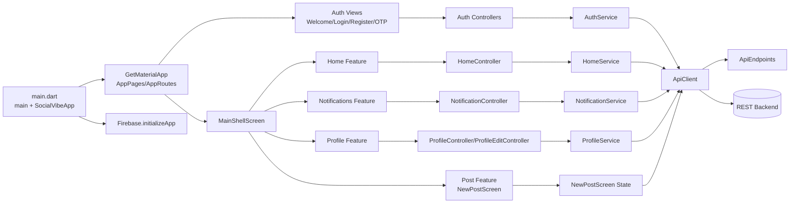
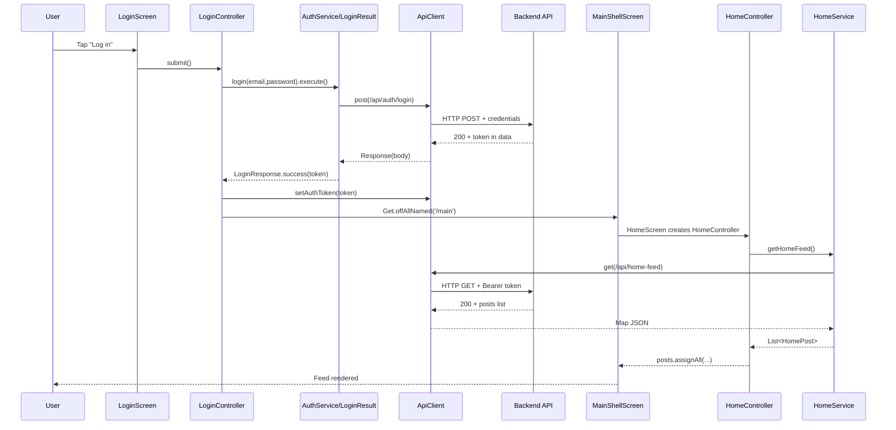

# Social Platform App Technical Documentation

## Table of Contents
1. [Architecture Overview](#architecture-overview)
2. [Project Flow Explanation](#project-flow-explanation)
3. [Diagrams](#diagrams)
4. [File-by-File Walkthrough (`lib/`)](#file-by-file-walkthrough-lib)
5. [Presentation Notes](#presentation-notes)

## Architecture Overview

### App Entry Points
- `lib/main.dart`
  - `main()` initializes Flutter bindings, initializes Firebase via `Firebase.initializeApp(...)`, then runs `SocialVibeApp`.
  - `SocialVibeApp` uses `GetMaterialApp` with:
    - `initialRoute: AppRoutes.welcome`
    - `getPages: AppPages.routes`
- `bootstrap.dart`
  - **Inference:** No `bootstrap.dart` file exists in this project.

### Routing / Navigation Flow
- Routing constants: `lib/routes/app_routes.dart` (`AppRoutes`).
- Route table: `lib/routes/app_pages.dart` (`AppPages.routes`) using `GetPage`.
- Main routes:
  - `/` -> `WelcomeScreen`
  - `/login` -> `LoginScreen` (with `AuthBinding`)
  - `/register` -> `RegisterScreen` (with `AuthBinding`)
  - `/otp` -> `OtpScreen` (with `AuthBinding`)
  - `/main` -> `MainShellScreen` (binds `MainShellController`, `ProfileController`)
  - `/profile` -> `ProfileScreen` (binds `ProfileController`)
  - `/profile-edit` -> `ProfileEditScreen` (binds `ProfileEditController`)
- Navigation style:
  - `Get.toNamed(...)`, `Get.offAllNamed(...)`, and `Get.to(...)`.

### State Management Approach
- Primary approach: **GetX**.
  - Controllers extend `GetxController`.
  - Reactive state uses `.obs`, `Rxn<T>`, `RxList<T>`.
  - UI reacts via `Obx(...)` and `GetView<TController>`.

### Dependency Injection Setup
- GetX DI is used through bindings and direct registration:
  - `AuthBinding` (`lib/features/auth/bindings/auth_binding.dart`):
    - `Get.put(LoginController(), permanent: true)`
    - `Get.lazyPut(RegisterController, fenix: true)`
    - `Get.lazyPut(OtpController, fenix: true)`
  - In `AppPages`, some routes use `BindingsBuilder` + `Get.put(...)`.
  - Some views also directly register controllers with `Get.put(...)` (e.g., `HomeScreen`, `NotificationScreen`).

### Network Layer (Dio / Interceptors / Endpoints)
- HTTP client: `lib/core/network/api_client.dart` (`ApiClient`) using `package:http/http.dart`.
- **No Dio and no interceptor chain** are present.
- `ApiClient` supports:
  - `post(...)` -> returns GetX `Response`
  - `get(...)` -> returns `Map<String, dynamic>`
  - `postMultipart(...)`
  - `delete(...)`
- Auth header injection:
  - Internal `_authToken` added as `Authorization: Bearer <token>` in `_buildHeaders()`.
- Endpoint registry:
  - `lib/core/constants/api_endpoints.dart` (`ApiEndpoints`) defines base URL and route paths.

### Storage (Secure Storage / Shared Preferences)
- **Inference:** No `flutter_secure_storage`, `shared_preferences`, Hive, or local persistence code exists in `lib/`.
- Token is kept in-memory only via `ApiClient._authToken` and set by `ApiClient.instance.setAuthToken(...)`.

### Error Handling Strategy
- Network-level exceptions are normalized into `ApiException` (`ApiClient`).
- Services and controllers catch exceptions and map them to:
  - field errors (e.g., `LoginController.emailError`, `passwordError`),
  - reactive error strings (`errorMessage` in `HomeController`, `NotificationController`),
  - snackbars (`SnackbarHelper.showError/showSuccess`).
- UI displays loading/error states using `Obx` branches.

### Feature / Module Structure
- `lib/features/auth`:
  - `bindings/`, `controllers/`, `services/`, `views/`
- `lib/features/main`:
  - shell/bottom-nav orchestration
- `lib/features/home`:
  - feed models/service/controller/view
- `lib/features/notifications`:
  - notification models/service/controller/view
- `lib/features/profile`:
  - profile data/edit/settings/dialogs
- `lib/features/post`:
  - new post creation UI + multipart upload
- Shared layers:
  - `lib/core/constants`, `lib/core/network`, `lib/core/utils`, `lib/core/widgets`, and routing files.

## Project Flow Explanation

### App Launch -> Initialization -> First Screen
1. `main()` in `lib/main.dart` runs `WidgetsFlutterBinding.ensureInitialized()`.
2. Firebase is initialized with `DefaultFirebaseOptions.currentPlatform` from `lib/firebase_options.dart`.
3. `SocialVibeApp` starts `GetMaterialApp`.
4. Initial route is `AppRoutes.welcome` (`/`) -> `WelcomeScreen`.

### Typical API Request Flow (UI -> Presentation -> Domain -> Data -> Network -> Response -> UI)
- This project does not implement a strict Clean Architecture domain layer. Practical flow is:
1. UI event in View (`LoginScreen`, `HomeScreen`, `ProfileScreen`, etc.).
2. Controller method (`LoginController.submit`, `HomeController.fetchHomeFeed`, etc.).
3. Service call (`AuthService`, `HomeService`, `ProfileService`, `NotificationService`).
4. `ApiClient` executes HTTP call to `ApiEndpoints` path.
5. Response is decoded and mapped to models.
6. Controller updates reactive state.
7. UI redraws through `Obx` and shows data/errors.

### Auth Token Lifecycle
- Acquisition:
  - Email/password login: `AuthService.LoginResult.execute()` parses token from `res.body['data']['token']`.
  - `LoginController.submit()` calls `ApiClient.instance.setAuthToken(result.token!)` on success.
- Usage:
  - `ApiClient._buildHeaders()` injects bearer token in all requests once set.
- Clearing:
  - `AuthService.logout()` and `AuthService.deleteAccount()` call `_client.setAuthToken(null)`.
  - `ProfileController.logout()` also forces `ApiClient.instance.setAuthToken(null)` in `finally`.
- Refresh:
  - **Inference:** No refresh-token mechanism exists.
- Persistence across app restarts:
  - **Inference:** Not persisted; token resets after app relaunch.

### How Errors Travel to UI
- `ApiClient` throws `ApiException` for non-2xx or connectivity/format failures.
- Services typically rethrow or let exceptions bubble.
- Controllers catch and map to user-visible feedback:
  - form field error strings (`LoginController`, `RegisterController`),
  - screen-level error text (`HomeController.errorMessage`, `NotificationController.errorMessage`),
  - snackbars (`SnackbarHelper` or direct `Get.snackbar`).

## Diagrams

### Component Diagram

### Sequence Diagram (Login -> Main -> Home Feed)

## File-by-File Walkthrough (`lib/`)

### `lib/main.dart`
- Purpose: App bootstrap and root `GetMaterialApp` setup.
- Key classes/functions: `main()`, `SocialVibeApp`.
- Important dependencies: `firebase_core`, `get`, `AppPages`, `AppRoutes`, `AppColors`.
- Connections: Entry point; points routing to `AppPages.routes`.

### `lib/firebase_options.dart`
- Purpose: Generated Firebase platform configuration.
- Key classes/functions: `DefaultFirebaseOptions.currentPlatform`.
- Important dependencies: `firebase_core`.
- Connections: Used by `main()` during Firebase initialization.

### `lib/routes/app_routes.dart`
- Purpose: Central route name constants.
- Key classes/functions: `AppRoutes`.
- Important dependencies: none.
- Connections: Consumed by views/controllers/navigation and `AppPages`.

### `lib/routes/app_pages.dart`
- Purpose: Route table + per-route bindings.
- Key classes/functions: `AppPages.routes`.
- Important dependencies: `get`, auth/profile/main views and controllers.
- Connections: Used by `GetMaterialApp.getPages`.

### `lib/core/network/api_client.dart`
- Purpose: Shared HTTP client abstraction and exception normalization.
- Key classes/functions: `ApiClient`, `ApiException`, `post/get/postMultipart/delete`, `setAuthToken`.
- Important dependencies: `http`, `ApiEndpoints`, GetX `Response`.
- Connections: Called by all services; injects bearer token globally.

### `lib/core/constants/api_endpoints.dart`
- Purpose: API base URL and endpoint constants.
- Key classes/functions: `ApiEndpoints` + `likeToggle(int)`.
- Important dependencies: none.
- Connections: Used by services and `NewPostScreen`.

### `lib/core/constants/app_colors.dart`
- Purpose: App-wide color palette constants.
- Key classes/functions: `AppColors`.
- Important dependencies: Flutter `Color`.
- Connections: Used across widgets/screens/themes.

### `lib/core/constants/app_text_styles.dart`
- Purpose: Shared text style constants.
- Key classes/functions: `AppTextStyles`.
- Important dependencies: `AppColors`.
- Connections: Reused across auth and common UI.

### `lib/core/utils/snackbar_helper.dart`
- Purpose: Unified snackbar utility.
- Key classes/functions: `SnackbarHelper.showError/showSuccess`.
- Important dependencies: `get`, `material`.
- Connections: Called in controllers for feedback.

### `lib/core/utils/validators.dart`
- Purpose: Form validation helpers.
- Key classes/functions: `Validators.requiredField/email/minLength`.
- Important dependencies: `RegExp`.
- Connections: Used by login/register/edit forms.

### `lib/core/widgets/app_text_field.dart`
- Purpose: Reusable styled `TextFormField` with optional reactive error text.
- Key classes/functions: `AppTextField`.
- Important dependencies: `AppColors`.
- Connections: Used mainly in auth forms.

### `lib/core/widgets/primary_button.dart`
- Purpose: Shared gradient CTA button with loading state.
- Key classes/functions: `PrimaryButton`.
- Important dependencies: `AppColors`, `AppTextStyles`.
- Connections: Used in welcome/login/register/otp.

### `lib/core/widgets/info_row.dart`
- Purpose: Label/value row UI block.
- Key classes/functions: `InfoRow`.
- Important dependencies: `AppColors`.
- Connections: Reusable presentation component.

### `lib/core/widgets/section_title.dart`
- Purpose: Small reusable section title widget.
- Key classes/functions: `SectionTitle`.
- Important dependencies: `AppColors`.
- Connections: Shared UI building block.

### `lib/core/widgets/social_icon_button.dart`
- Purpose: Reusable social login button style.
- Key classes/functions: `SocialIconButton`.
- Important dependencies: `AppColors`.
- Connections: Used in login/register social sections.

### `lib/features/auth/bindings/auth_binding.dart`
- Purpose: DI binding for auth controllers.
- Key classes/functions: `AuthBinding.dependencies()`.
- Important dependencies: `get`, auth controllers.
- Connections: Attached to login/register/otp routes in `AppPages`.

### `lib/features/auth/services/auth_service.dart`
- Purpose: Auth API integration and login result parsing.
- Key classes/functions: `AuthService`, `LoginResult`, `LoginResponse`, `LoginStatus`, `OtpMethods` extension.
- Important dependencies: `ApiClient`, `ApiEndpoints`, `ApiException`.
- Connections: Used by `LoginController`, `RegisterController`, `OtpController`, `ProfileController`, `DeleteAccountDialog`.

### `lib/features/auth/services/google_sigin_service.dart`
- Purpose: Google OAuth token acquisition through `google_sign_in`.
- Key classes/functions: `GoogleSignService`, `signInAndGetAccessToken`, `signOut`.
- Important dependencies: `google_sign_in`.
- Connections: Called by `LoginController.signInWithGoogle()`.

### `lib/features/auth/controllers/login_controller.dart`
- Purpose: Login form state, validation, auth submission, and navigation.
- Key classes/functions: `LoginController`, `submit`, `loginGoogle`, `signInWithGoogle`.
- Important dependencies: `AuthService`, `ApiClient`, `Validators`, `SnackbarHelper`, `AppRoutes`.
- Connections: Consumed by `LoginScreen`; navigates to `/main` on success.

### `lib/features/auth/controllers/register_controller.dart`
- Purpose: Registration form handling and error mapping.
- Key classes/functions: `RegisterController`, `submit`, `_handleRegisterError`.
- Important dependencies: `AuthService`, `SnackbarHelper`, `AppRoutes`.
- Connections: Used by `RegisterScreen`; navigates to `/otp` with email argument.

### `lib/features/auth/controllers/otp_controller.dart`
- Purpose: OTP verification/resend flow.
- Key classes/functions: `OtpController`, `verify`, `resend`.
- Important dependencies: `AuthService`, `SnackbarHelper`, `AppRoutes`, `Get.arguments`.
- Connections: Used by `OtpScreen`; returns to `/login` after verification.

### `lib/features/auth/views/welcome_screen.dart`
- Purpose: Public entry UI with Sign up / Log in actions.
- Key classes/functions: `WelcomeScreen`.
- Important dependencies: `PrimaryButton`, `AppRoutes`, `Get`.
- Connections: Navigates to register/login screens.

### `lib/features/auth/views/login_screen.dart`
- Purpose: Login form UI with social login buttons.
- Key classes/functions: `LoginScreen` (`GetView<LoginController>`).
- Important dependencies: auth controller, shared widgets/styles, `AppRoutes`.
- Connections: Triggers controller methods and route transitions.

### `lib/features/auth/views/register_screen.dart`
- Purpose: Registration form UI.
- Key classes/functions: `RegisterScreen` (`GetView<RegisterController>`).
- Important dependencies: validators, shared widgets/styles.
- Connections: Calls `RegisterController.submit()`.

### `lib/features/auth/views/otp_screen.dart`
- Purpose: OTP input and verification/resend UI.
- Key classes/functions: `OtpScreen` (`GetView<OtpController>`).
- Important dependencies: `PrimaryButton`, auth controller.
- Connections: Invokes `OtpController.verify/resend`.

### `lib/features/main/controllers/main_shell_controller.dart`
- Purpose: Bottom-nav tab index and shell-level actions.
- Key classes/functions: `MainShellController`, `changeTab`, `openCreatePost`.
- Important dependencies: `ProfileController`, `NewPostScreen`, `Get.arguments`.
- Connections: Used by `MainShellScreen`; triggers profile refresh when tab 3 selected.

### `lib/features/main/views/main_shell_screen.dart`
- Purpose: Main app scaffold with `IndexedStack`, bottom navigation, and center post button.
- Key classes/functions: `MainShellScreen`, private `_NavItem`.
- Important dependencies: `MainShellController`, `HomeScreen`, `NotificationScreen`, `ProfileScreen`.
- Connections: Hosts top-level in-app navigation after auth.

### `lib/features/home/models/home_feed_model.dart`
- Purpose: Home feed JSON models.
- Key classes/functions: `HomeFeedResponse`, `HomePost`, `FeedUser`, `HomePost.copyWith`.
- Important dependencies: none.
- Connections: Used by `HomeService` and `HomeController`.

### `lib/features/home/services/home_service.dart`
- Purpose: Fetch home feed and toggle likes.
- Key classes/functions: `HomeService.getHomeFeed`, `toggleLike`.
- Important dependencies: `ApiClient`, `ApiEndpoints`, `HomePost`.
- Connections: Called by `HomeController`.

### `lib/features/home/controllers/home_controller.dart`
- Purpose: Home feed state/loading/error + optimistic like updates.
- Key classes/functions: `HomeController`, `fetchHomeFeed`, `refreshFeed`, `toggleLike`.
- Important dependencies: `HomeService`, `HomePost`.
- Connections: Used by `HomeScreen`; updates reactive post list.

### `lib/features/home/views/home_screen.dart`
- Purpose: Feed list UI with refresh and post card interactions.
- Key classes/functions: `HomeScreen`, private `_PostCard`.
- Important dependencies: `HomeController`, `HomePost`, `Get.put`.
- Connections: Reads controller state and calls like toggle.

### `lib/features/notifications/models/app_notification.dart`
- Purpose: Notification domain models + helper getters.
- Key classes/functions: `AppNotification`, `NotificationActor`, `NotificationPost`, `shortTime`, `isLike/isFollow`.
- Important dependencies: `DateTime` parsing.
- Connections: Used by notification service/controller/view.

### `lib/features/notifications/services/notification_service.dart`
- Purpose: Load notifications list from API.
- Key classes/functions: `NotificationService.getNotifications`.
- Important dependencies: `ApiClient`, `ApiEndpoints`, `AppNotification`.
- Connections: Called by `NotificationController`.

### `lib/features/notifications/controllers/notification_controller.dart`
- Purpose: Notifications state/loading/error orchestration.
- Key classes/functions: `NotificationController`, `fetchNotifications`, `refreshNotifications`.
- Important dependencies: `NotificationService`.
- Connections: Used by `NotificationScreen`.

### `lib/features/notifications/views/notification_screen.dart`
- Purpose: Notifications UI list with follow/thumbnail actions.
- Key classes/functions: `NotificationScreen`, `_NotificationTile`, `_FollowButton`, `_PostThumbnail`.
- Important dependencies: `NotificationController`, `AppNotification`, `Get.put`.
- Connections: Renders controller state and model-driven tile behavior.

### `lib/features/post/views/new_post_screen.dart`
- Purpose: Create post screen with image picker and multipart upload.
- Key classes/functions: `NewPostScreen`, `_NewPostScreenState`, `_pickImage`, `_submitPost`.
- Important dependencies: `image_picker`, `ApiClient.postMultipart`, `ApiEndpoints.createPost`.
- Connections: Opened from `MainShellController.openCreatePost()`.

### `lib/features/profile/models/profile_model.dart`
- Purpose: User profile model.
- Key classes/functions: `ProfileModel`, `fullName`, `fromJson`.
- Important dependencies: none.
- Connections: Used across profile controllers/views/services and shell argument updates.

### `lib/features/profile/models/profile_post_model.dart`
- Purpose: Profile grid post model (id + picture).
- Key classes/functions: `ProfilePostModel`, `fromJson`.
- Important dependencies: none.
- Connections: Used by `ProfileService.getMyPhotos` and `ProfileController.posts`.

### `lib/features/profile/services/profile_service.dart`
- Purpose: Profile API methods (me, update multipart, photos).
- Key classes/functions: `ProfileService.getMe`, `updateProfile`, `getMyPhotos`.
- Important dependencies: `ApiClient`, `ApiEndpoints`, profile models.
- Connections: Called by `ProfileController` and `ProfileEditController`.

### `lib/features/profile/controllers/profile_controller.dart`
- Purpose: Profile screen state, fetch profile/posts, logout.
- Key classes/functions: `ProfileController`, `fetchProfile`, `fetchMyPosts`, `logout`.
- Important dependencies: `ProfileService`, `AuthService`, `ApiClient`, `SnackbarHelper`, `AppRoutes`.
- Connections: Used by `ProfileScreen`, settings dialogs, and `MainShellController`.

### `lib/features/profile/controllers/profile_edit_controller.dart`
- Purpose: Edit profile form state, media picking, save/update workflow.
- Key classes/functions: `ProfileEditController`, `_loadProfile`, `pickAvatar`, `pickCover`, `selectBirthDate`, `save`.
- Important dependencies: `ProfileService`, `ImagePicker`, `SnackbarHelper`, `AppRoutes`.
- Connections: Used by `ProfileEditScreen`; returns user to `/main` tab index 3 with updated profile arg.

### `lib/features/profile/views/profile_screen.dart`
- Purpose: Profile page UI with header, bio, edit, and grid posts.
- Key classes/functions: `ProfileScreen`, `_ProfileHeader`, `_ProfileBioSection`, `_PostsGrid`, etc.
- Important dependencies: `ProfileController`, `ProfileModel`, `SettingsScreen`, `AppRoutes`.
- Connections: Opens edit/settings; consumes controller reactive profile/posts.

### `lib/features/profile/views/profile_edit_screen.dart`
- Purpose: Profile edit UI form and save action.
- Key classes/functions: `ProfileEditScreen`, `_AvatarHeader`, `_ProfileEditField`, `_ReadOnlyField`.
- Important dependencies: `ProfileEditController`, `ProfileModel`, `AppColors`.
- Connections: Calls `controller.save()` which updates backend and navigates to main/profile tab.

### `lib/features/profile/screens/settings_screen.dart`
- Purpose: Settings menu and account actions.
- Key classes/functions: `SettingsScreen` and UI helper methods.
- Important dependencies: `ProfileController`, `DeleteAccountDialog`, `LogoutConfirmDialog`.
- Connections: Accessed from `ProfileScreen`; opens logout/delete dialogs.

### `lib/features/profile/widgets/delete_account_dialog.dart`
- Purpose: Confirm account deletion and execute delete flow.
- Key classes/functions: `DeleteAccountDialog`.
- Important dependencies: `AuthService`, `ProfileController`, `AppRoutes`.
- Connections: Triggered from settings; deletes account then logs out.

### `lib/features/profile/widgets/logout_confirm_dialog.dart`
- Purpose: Confirm logout action.
- Key classes/functions: `LogoutConfirmDialog`.
- Important dependencies: `ProfileController`.
- Connections: Triggered from settings; calls `ProfileController.logout()`.

## Presentation Notes

### 10 Talk Track Bullets
- The app is structured by feature modules (`auth`, `home`, `notifications`, `profile`, `post`) with a shared `core` layer.
- Navigation and state are both handled by GetX, reducing boilerplate for routing + controller DI.
- Startup is minimal: Flutter binding, Firebase init, then route-based app boot.
- Auth flow is explicit: register -> OTP verify -> login -> main shell.
- API access is centralized in a custom `ApiClient` with unified exception wrapping.
- Token injection is global through `ApiClient._buildHeaders()` and `setAuthToken`.
- Home feed and notifications use reactive controllers with loading/error/empty states.
- Like toggling in home uses optimistic UI update with rollback on failure.
- Profile editing uses multipart upload for avatar/cover and repaints shell via route arguments.
- Current architecture is pragmatic but not full Clean Architecture (services act as data/domain hybrid).

### 5 Likely Q&A + Strong Answers
- Q: Why GetX instead of Provider/BLoC?
  - A: We use GetX for combined routing, DI, and reactive state in one stack, which speeds development and keeps controllers concise.
- Q: Where is the auth token persisted?
  - A: It currently stays in-memory in `ApiClient`; there is no secure local persistence yet.
- Q: How are API errors standardized?
  - A: `ApiClient` maps network/HTTP/parsing failures into `ApiException`, then controllers convert those into field errors/snackbars/UI messages.
- Q: Is there refresh-token support?
  - A: Not yet; token refresh and automatic retry are currently missing.
- Q: How do modules stay decoupled?
  - A: Views depend on controllers, controllers depend on services/models, and network details are isolated in `ApiClient` + endpoint constants.

### Risks / Tech Debt + Quick Wins
- Risk: Auth token is not persisted securely; users likely need re-login after restart.
  - Quick win: Add `flutter_secure_storage` and hydrate token during app startup.
- Risk: No refresh-token lifecycle or automatic 401 handling.
  - Quick win: Add refresh endpoint handling and request retry policy.
- Risk: DI is mixed (bindings + `Get.put` inside views), which can duplicate controller lifecycles.
  - Quick win: Move all controller creation to bindings.
- Risk: Error handling messages are inconsistent (`toString()` leaks raw exception text in some screens).
  - Quick win: Standardize error mapper utility per feature.
- Risk: No explicit repository/domain abstraction; services blend concerns.
  - Quick win: Introduce repository interfaces incrementally for auth/profile first.
